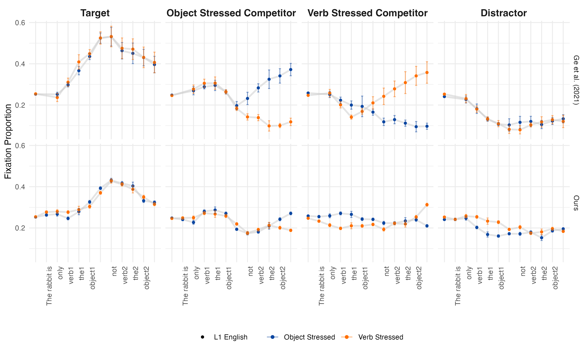
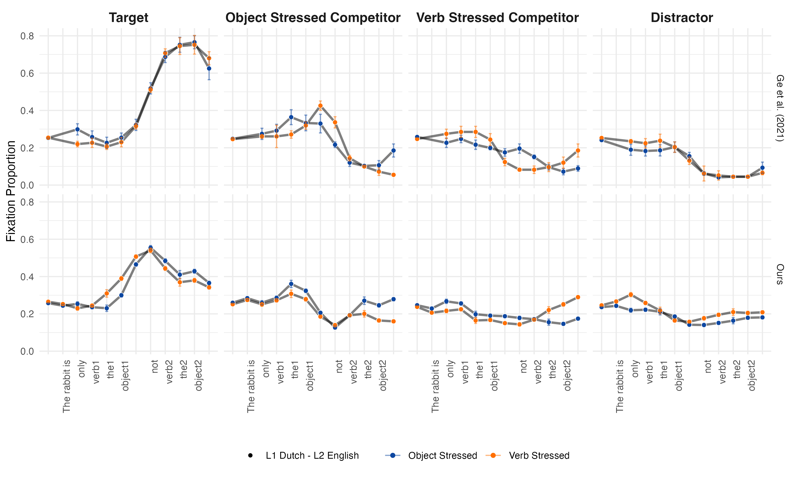
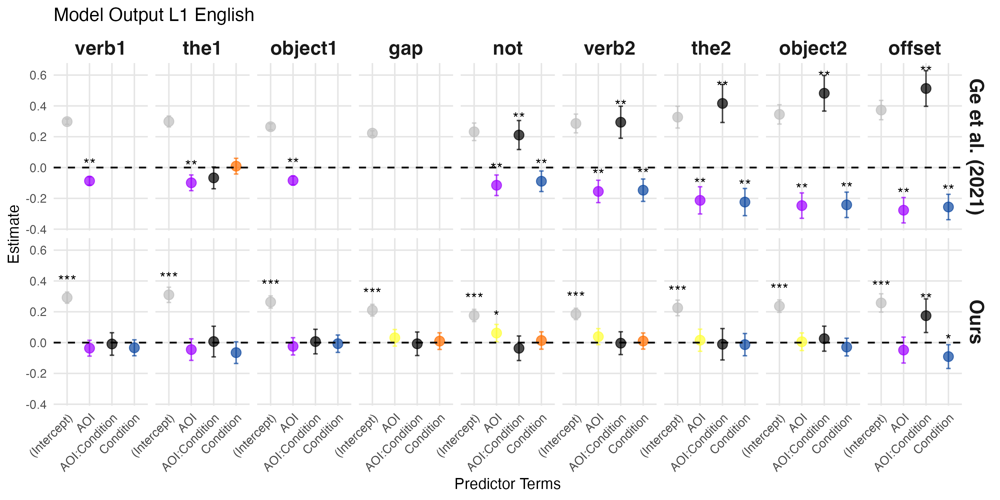
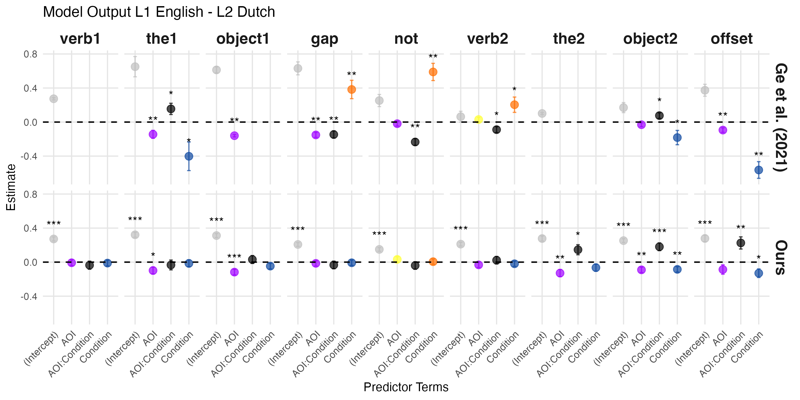
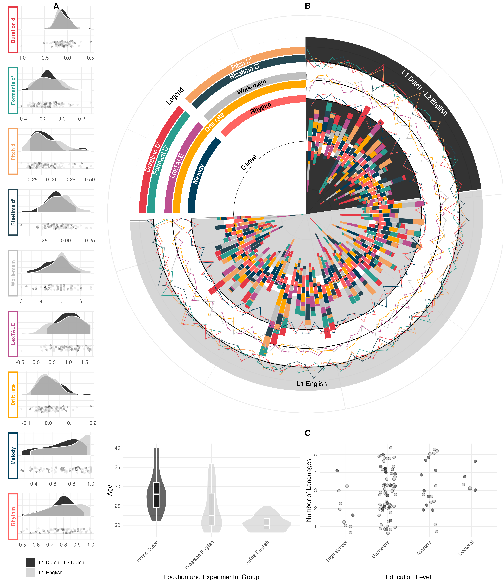
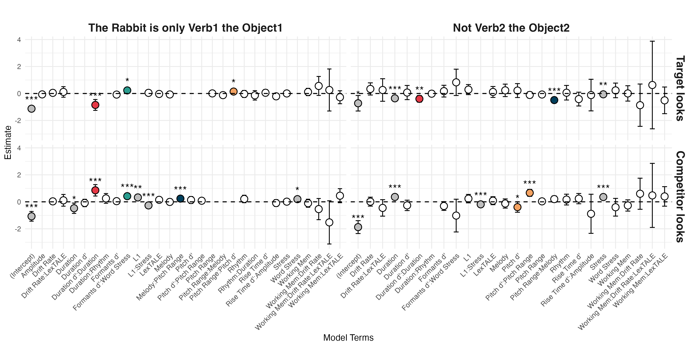

# Focus (on) Replication: The FiREE Replication Framework

## *Reference:*  
**Bramlett, A. A. & Wiener, S. (2024).** *Focus (on) Replication: The Fidelity, Refinement, and Exploratory Extension (FiREE) Replication Framework*. *[Journal Name]*.

## Additional Resources  
For further details and resources related to this project, please visit the following link:  
[Open Science Framework - Project Repository]([https://osf.io/wa4gv/?view_only=de113dbced6b46fab96ca8217b3c1ca6](https://osf.io/wa4gv/?view_only=7664751c20804602971b048cee7262e9)).

## Overview  
This project introduces the **FiREE Replication Framework**, a structured approach to replication that integrates **Fidelity**, **Refinement**, and **Exploratory Extension**. The framework was developed to balance adherence to original study designs with improved statistical rigor and theoretical extensions. Our study applies FiREE to a web-based eye-tracking replication of **Ge, Mulders, Kang, Chen, & Yip (2021)**.

## Key Features  
- **Fidelity:** Direct replication using the original study's design and statistical analyses.  
- **Refinement:** Improved modeling techniques (e.g., Generalized Additive Models, LASSO feature selection).  
- **Exploratory Extension:** Investigation of individual differences and acoustic-phonetic factors in focus processing.  
- **Open-Science Tools:** Full dataset, analysis scripts, and replication materials available via OSF.  

### Fidelity
**Replicated Fixation Proportions (English):**  
   
- **Replicated Fixation Proportions (Dutch):**  
  
- **Fidelity model output (English):**  
  
- **Fidelity model output (Dutch):**  
  

### Refinement
- **Fidelity model output (Dutch):**  
  

### Exploratory Extension
- **Individual Differences Analysis:**  
    
- **Acoustic Properties by Time Bin:**  
  
- **Individual differences Model Output:**  
    

## Contributing  
Contributions are welcome! Feel free to report issues, improve documentation, or suggest new features through GitHub issues or pull requests.

## Citation  
If you use this framework in your research, please cite:  
> **Bramlett, A. A. & Wiener, S. (2024).** *Focus (on) Replication: The Fidelity, Refinement, and Exploratory Extension (FiREE) Replication Framework*. *[Journal Name]*.
